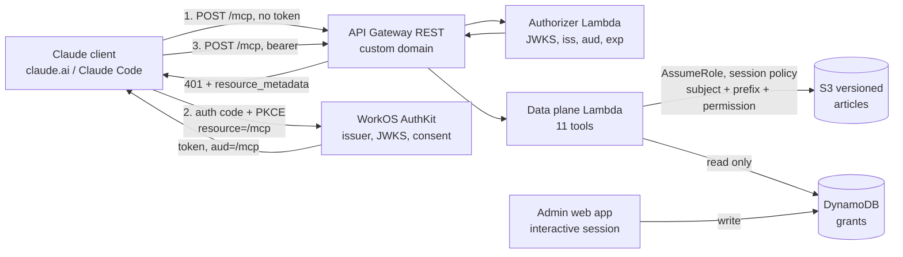

# mcp4me Architecture

2026-09-17 · Josh Famestad

## System overview

One instance is a pure OAuth 2.1 resource server on API Gateway and two Lambda functions, with WorkOS AuthKit answering *who is calling* and everything after the token owned by the substrate. State is one versioned S3 bucket for articles and one DynamoDB table for grants. Nothing is always-on.

Reading the diagram: the client never talks to the substrate about identity; it talks to WorkOS, and the substrate only ever validates what WorkOS issued. The data plane cannot write a grant (its role is read-only on the table) and cannot read broadly (the S3 credential it mints is scoped to the caller). The admin web app is the only writer of grants and runs behind an interactive human session, so no MCP tool can change who sees what.

**Environments.** Two AWS accounts, not two stacks: `wiki.famestad.com` (prod) and `wiki-dev.famestad.com` (dev, account 588747760390). Each has its own bucket, table, KMS key, canonical resource URI and WorkOS resource-indicator registration. Development data is synthetic; family records never enter the dev account.

**Status, 17 Sep 2026 (gate updated 23 Sep 2026).** Built: skeleton plus increments A–G, 1,275 unit tests, synth-clean for dev and prod; certificate stack hand-deployed. CIMD is enabled and the HANDOFF §2 gate has run against WorkOS staging: checks 1, 3, 4 and 5 passed, along with the AS-9 token-lifetime check; check 6 (CIMD origin allowlist) does not exist in the WorkOS dashboard, so that control stays a wish; check 7 self-signup is now disabled. Not deployed: blocked on AWS credentials for the dev account, and the authorizer itself is still unwritten.

Source: `HANDOFF.md` in the mcp4me.com repository (13 Sep 2026), the authoritative reference; where this document and it disagree, it wins.

## Model and vocabulary

Six nouns carry the whole design; everything else is a rule about one of them.

| Term | Definition |
| --- | --- |
| Instance | One deployment, one organization, one root URL. Owns exactly one tree and one authorization server. |
| Resource | A node in the tree: a folder or an article, addressed by an absolute lowercase path such as `/racing/setup/rear-bar.md`. |
| Version | An immutable snapshot of one article's body and frontmatter plus its author and timestamp. Never modified or deleted. |
| Principal | A user. There is only one kind; insiders and invitees are the same object holding different grants. |
| Grant | A tuple *(principal, node, permission)*. Folder grants cascade; article grants apply to one article. |
| Pointer | A tombstone version at a vacated path recording where the content went. |

**Path grammar.** Slash-separated, lowercase, `.md`-suffixed for articles, ≤ 512 characters. No `.` or `..` segments; no segment beginning with `_` (reserved for system objects). `index.md` and `log.md` are reserved and rejected on create; both are generated per request, filtered to the caller's grants, never stored. Nothing normalizes: a bad path is rejected so the agent sees it.

**The tree is the manual.** No ordering field, no table-of-contents object. Position says where an article belongs; links say what to read next. The same hierarchy carries structure and permission, so a section split for narrative reasons is also a permission boundary. This is the intended constraint: one structure to reason about instead of two that drift.

**Frontmatter (OKF v0.2 aligned).** `type` required, starting vocabulary one value: `doc`. `pointer` and `archived` are server-only and rejected on input. Adopted: `title`, `description`, `resource`, `tags`; the actor convention `human:<id>` / `<producer>/<version>` / `process:<id>`; the trust family `generated` / `verified`; the lifecycle family `status` / `stale_after`; `sources`. One extension: `seq`, a monotonic integer the server maintains on every write, for ordering and staleness reasoning, never for concurrency. Unknown keys round-trip.

**Attribution is not frontmatter.** The user who made each write, and the kind of write, live in server-set S3 object metadata. Agents rewrite frontmatter freely; they cannot rewrite who did what.

**Concept identity.** An article's OKF concept id is its path minus `.md`. Relationships are ordinary markdown links whose meaning comes from surrounding prose. Cross-instance references (v2) use the same URL-shaped grammar, `{root}/a/{path}`, so nothing is rewritten when outside sharing arrives.

## Authorization

WorkOS answers who is calling; the substrate owns everything downstream of the token. The substrate implements no `/authorize`, `/token` or `/register`, so replacing the authorization server later touches three things: the `authorization_servers` entry, the JWKS URL and issuer, and the resource-indicator registration.

**The split**

| WorkOS | Substrate |
| --- | --- |
| Client registration (CIMD; DCR off) | Protected resource metadata (RFC 9728) at `/.well-known/oauth-protected-resource` and `…/mcp` |
| Authorization code + PKCE, consent screen | Bearer validation on every request: signature vs JWKS, `iss`, `aud` = canonical MCP URL, expiry; algorithm pinned |
| Token issuance, refresh rotation, revocation | Positional grant decisions: `read` / `write` / `own` |
| Audience binding via resource indicators | Grant-write guard: owners grant only within their subtree |
| User directory and login methods | Audit log of reads, writes, grants and denials |

**Resource identity.** Canonical resource `https://wiki.famestad.com/mcp`; that string is the `aud` of every accepted token, byte for byte, and each environment registers its own. Provisioning fails if registration fails. Gate check 4, an unregistered resource being *refused* rather than silently issued against a default audience, is what keeps instances isolated.

**Grants are the only authority.** ADR-0016 withdrew the custom-scope tier `wiki.read` / `wiki.write` once proposed above the grant layer: WorkOS issues scopes only from permissions assigned per-application in its dashboard, and a CIMD-registered client — how Claude registers — has no Scopes section to assign them from. The grant store was always where path granularity lived, and it is now the whole of what a token can touch. `Tool.scope` survives as a read/write classification for the write rate limit; it is not checked.

**Permissions**

| Permission | Confers | Implies |
| --- | --- | --- |
| `read` | The live article and the version history of that path | — |
| `write` | Create, update, move, archive, unarchive | `read` |
| `own` | Every permission on that node and beneath, including granting any of them, `own` included | all |

There is no `history` permission: history lives at the path and the path's grant governs it. So editing is not redaction; to put text out of reach, move the article. An admin is simply the owner of `/`.

**Grant semantics.** Any node may be a target. Effective permission is the additive union of every matching grant; there are no deny rules, restructure the tree instead. All grants are positional, article grants included: an article moved into a granted prefix becomes readable by that prefix's grantees, and one moved out stops being. A grant on a vacated path survives as pointer access. Article grants are searchable, not listable: `list_folder` on the parent still returns `404`, because the siblings are not the grantee's to see.

**A move is a boundary decision.** `move_article` computes the full impact, who gains and who loses. A move through which anyone gains access is refused on the tool surface (`403 boundary_change`, carrying the report) and performed in the web application where a person confirms. Moves that widen nobody's access proceed and return the report.

**The admin boundary.** No operation that creates a principal or changes a grant is an MCP tool: `create_user`, `grant_access`, `revoke_access`, `read_audit_log`, `hard_delete` are absent, and their absence is a security control. Text an agent reads can instruct it; a reachable `grant_read` turns prompt injection into privilege escalation in one step. Enforced by IAM: the data-plane role is read-only on the grant table, and only the web application's role can write it. The safe form of "share this with Dana" is a pending grant request a human approves.

**Where enforcement lives.** The storage identity carries exactly the requesting user's permissions by construction. Every read is scoped by subject at the point the data is fetched, never fetched broadly and filtered in code. The test: could a bug in the application layer leak anything? If yes, the credential is too strong. A zero-grant user causes no `AssumeRole` call at all.

**Delegation.** Owners grant within their subtree at any level including `own`. Who may grant on a path is the set of owners of that path and every ancestor, a walk bounded by tree depth. Grants record their granter and outlive them; unowned grants surface for review, never silent deletion.

**Normative clauses AS-1 to AS-11** (HANDOFF §4.2) are the contract: pure resource server; metadata at both paths with AuthKit as the only `authorization_servers` entry; `401` with `WWW-Authenticate` carrying `resource_metadata` on every unauthenticated request; full validation every request with the authorizer cache at zero; never forward a received token; CIMD on, DCR off; access tokens ≤ 15 min with rotated refresh; denied reads logged; endpoint on globally routable IPv4 reachable from Anthropic's egress range.

## Storage

S3 carries the tree, the content, the version history and the enforcement; one small DynamoDB table holds grants and nothing else. Reads and conditional writes are native S3 verbs; move, archive and history are one or two ordinary writes on top. The design is mostly a matter of not building things.

**Bucket layout.** One bucket per environment, versioning on, SSE-KMS with a customer-managed key, account-level public-access block. Object Lock in production only, governance mode, one-year default retention; dev buckets are unlocked so the account can be torn down.

| Key | Holds |
| --- | --- |
| `a/<path>.md` | Articles; the key is the OKF concept id |
| `a/<path>/_listing.json` | Per-folder projection of children's frontmatter; inherits the folder's grants because it sits inside it |
| `sys/` | System objects, never inside any content grant |

Every `PutObject` carries server-set user metadata: `x-amz-meta-actor` (`human:<subject>`), `x-amz-meta-kind` (`write`, `archive`, `unarchive`, `moved_in`, `moved_out`) and `x-amz-meta-moved-from` on `moved_in` versions. This is where attribution lives.

**Tombstones and pointers are just the next version.** An archive writes an object with `type: archived` at the same key; a move writes `type: pointer` with `moved_to` at the vacated key. A moved key's chain reads `[content, …, pointer]` and `ListObjectVersions` returns the history beneath it with no traversal to implement. The destination starts with a single version and inherits no chain, which is what makes the per-path history rule enforce itself: a caller at the new key physically cannot see the old key's versions.

**Write paths**

| Operation | Sequence |
| --- | --- |
| create | `PutObject If-None-Match: *`, then refresh parent listing |
| update | `PutObject If-Match: <etag>`, refresh listing if a projected field changed |
| archive | `PutObject` tombstone `If-Match: <etag>`, refresh listing (child leaves) |
| unarchive | `GetObject?versionId=<last content>`, `PutObject` restoring version `If-Match: <tombstone etag>` |
| move | `HeadObject to` (409 if occupied); `PutObject` pointer at `from` `If-Match: <if_version>`; `GetObject from` beneath the pointer; rewrite frontmatter `seq+1`; `PutObject to If-None-Match: *` with `moved_in`; refresh both listings |

**Why the pointer goes first.** A stale `if_version` fails at the pointer write with nothing written anywhere. Copy-first could strand a copy under the destination's grants for a move that was refused; pointer-first cannot. S3 has no atomic multi-object operation, so a move is two writes and the mitigation is idempotence: a crash between them leaves a pointer whose target is `404`, content intact one version beneath, and a retry completes the destination write. The window is milliseconds; during it the article is readable at neither path, the correct side to fail on. This is the one place the rejected DynamoDB-primary design was stronger, and it is named rather than glossed.

**Concurrency.** `if_version` is the S3 ETag; `If-Match` makes S3 do the compare-and-swap and a mismatch is `412`. On an SSE-KMS bucket the ETag is not a plaintext digest, so A→B→A yields three distinct tokens and the ABA case does not arise. `seq` is for ordering, never concurrency. `If-Match` needs `s3:GetObject` as well as `s3:PutObject`, so a write-only grant cannot perform a conditional write.

**Grant table** (DynamoDB, holds no content)

| Item | PK | SK | Attributes |
| --- | --- | --- | --- |
| Grant | `U#<subject>` | `<node path>` | `permission` (`read`/`write`/`own`), `granted_by`, `granted_at` |
| User | `U#<subject>` | `PROFILE` | `email`, `display_name`, `status` |

GSI1 `N#<node path>` / `<subject>` answers "who can reach this node" for the move-impact report and the console. Resolving the cascade for `/racing/setup/rear-bar.md` is one `BatchGetItem` over four sort keys (`/`, `/racing`, `/racing/setup`, the article), bounded by depth, never a scan.

**Credential minting.** Having decided, the data plane calls `sts:AssumeRole` on the storage role with an inline session policy naming only what this operation touches. Three shapes, defined once in `app/auth/credentials.py`, each with a negative test:

| Shape | Grants | Used by |
| --- | --- | --- |
| `read` | `s3:GetObject`, `s3:GetObjectVersion`, `kms:Decrypt` on the exact key or prefix | `read_article`, `read_version`, `list_versions`, search over article grants |
| `list` | `read` plus `s3:ListBucket` with an `s3:prefix` condition on the folder | `list_folder`, search over folder grants, listing rebuilds |
| `write` | `read` plus `s3:PutObject`, `kms:GenerateDataKey` on the same resource | every mutating tool; move mints one per end |

A read credential carries no `ListBucket`: an unconditioned `ListBucket` is a listing of the whole bucket, and that failure is a disclosure, not an error. Credentials cache per *(subject, prefix, shape)* for a configurable lifetime that moves together with token lifetime.

**Listing index.** `_listing.json` holds each folder's immediate children's frontmatter fields, rewritten on create, update, archive, unarchive and move; pointers and tombstones are excluded, which is how they leave listings. Every listing write is conditional on the ETag it read, so two agents creating siblings at once cannot drop each other's child; a `412` re-reads and retries. Rebuild is lazy on first read; authority is `ListObjectsV2` plus the objects. A folder appears in its parent only while it holds a visible child.

**Search.** Metadata matching over titles, descriptions and tags, filtered by path against the caller's grants: folder grants walk `_listing.json` from the prefix down; article grants do a ranged `GetObject` over the frontmatter. Only permitted paths are ever read, so there is no post-filter. When an engine arrives, the one requirement is that it carry the path as a filterable field and every query carry the caller's grant set; the tool contract does not change.

**Roles.** Authorizer: CloudWatch Logs only. Data plane: read-only on the grant table, `sts:AssumeRole` on the storage role, no S3 permissions of its own, so the minted credential is the only path to an object and there is nothing to forget with. Web app: the same plus grant-table writes, the only role that can change a grant. Storage role: the outer bound, never `s3:DeleteObjectVersion` or `s3:BypassGovernanceRetention`. Break-glass: hard delete and Object Lock bypass, assumed by a person in the console, logged by CloudTrail. No long-lived access keys anywhere.

**Cost and scale.** At family scale the largest line is the KMS key. Nothing in the layout changes at ten thousand articles: listings stay one read per folder, permission resolution stays bounded by depth, history stays partitioned per key by S3.

## Compute and hosting

API Gateway REST API, regional, with a Lambda REQUEST authorizer in front of a Lambda proxy integration; three Lambda functions, three roles; CDK in Python; two AWS accounts. Buffered responses, no streaming, nothing always-on.

**Why REST and not HTTP API.** The MCP discovery challenge needs a `401` carrying `WWW-Authenticate: Bearer resource_metadata="…"`. HTTP APIs cannot emit it: custom gateway responses are REST-only, the built-in JWT authorizer emits a fixed header, and a Lambda authorizer never sees an unauthenticated request. REST also allows integration timeouts past 29 s and a 20,480-byte header budget, which matters once a bearer JWT shares space with the mandatory MCP headers.

**Routes**

| Path | Method | Auth | Integration |
| --- | --- | --- | --- |
| `/mcp` | `POST` | Lambda authorizer | Lambda proxy, data plane |
| `/mcp` | `GET`, `DELETE` | none | Mock, `405` |
| `/mcp` | `OPTIONS` | none | CORS preflight |
| `/.well-known/oauth-protected-resource` and `…/mcp` | `GET` | none | Mock, static body: no compute, no cold start on the discovery path |
| `/app/*` | any | web app's own session cookie | Lambda proxy, web application |
| anything else | any |  | `404`, empty body |

**Gateway responses.** `UNAUTHORIZED` is customised with the `WWW-Authenticate` challenge plus `Access-Control-Allow-Origin: https://claude.ai` and `Access-Control-Expose-Headers: WWW-Authenticate`; a gateway response bypasses the integration, so the CORS config below does not apply to it and without those two lines a browser client cannot read the challenge. The authorizer triggers the `401` by raising, not by returning a Deny (a Deny is `403` and breaks discovery). `MISSING_AUTHENTICATION_TOKEN` is mapped to `404` (API Gateway's default for an unknown route is a misleading `403`); `DEFAULT_4XX`/`5XX` carry generic bodies. CORS is configured at the gateway, never in code: origin `https://claude.ai`, methods `POST, OPTIONS`, headers `authorization, content-type, mcp-protocol-version, mcp-method, mcp-name, mcp-param-*`, expose `WWW-Authenticate`.

**Functions and roles**

| Function | Does | Role holds |
| --- | --- | --- |
| Authorizer (`app/authorizer/`) | Validates the JWT: `PyJWT` with algorithm, issuer, audience and expiry pinned; passes `sub` and `scope` as context; result cache TTL 0 | CloudWatch Logs only |
| Data plane (`app/mcp/`, `app/auth/`, `app/storage/`) | Transport, `server/discover`, header and origin checks, the eleven tools; resolves grants; mints credentials | Read-only on the grant table; `sts:AssumeRole` on the storage role; no S3 of its own |
| Web application (`app/web/`) | Login and consent via its own confidential AuthKit client (ID token, access token discarded); read view; admin console; audit log; break-glass runbook | Data plane's plus grant-table writes: the only role that can change a grant |

The web app's session is a signed `__Host-` cookie (12 h), checked per request against the PROFILE row so disabling a person takes effect on their next click; a `session_epoch` on the PROFILE makes "sign out everywhere" immediate. It holds no WorkOS management API key: the operator creates people in the WorkOS dashboard, and the console records the resulting id, PROFILE row and initial grant. Markdown renders with HTML disabled.

**Stack.** Python 3.13 on Lambda, ARM64; `uv` and `pyproject.toml`; the MCP Python SDK in stateless mode with `server.py` hand-rolling whatever of the 2026-07-28 revision the SDK lacks; `boto3`; Jinja2 for the web app; CDK in Python; `pytest`. A `Makefile` wraps deploy, test, security and synth.

**CDK stacks** (`infra/`): storage (bucket with Object Lock in prod only, table, KMS key); API (REST API, routes, gateway responses, CORS, domain); compute (the functions and roles); ops (alarms, CI); and a **certificate stack** that is hand-deployed outside CI/CD, publishes the ACM certificate ARN to SSM, and is read by the API stack at deploy time.

**Custom domain.** Regional endpoint, ACM certificate in the same region, base path mapping `(none)` so `/mcp`, `/.well-known/…` and `/app/*` serve from one API and the protected resource metadata comes from the resource's own origin.

**Environments.** Separate AWS accounts for dev and prod, not separate stacks: the strongest guarantee that a development mistake cannot touch family records is that development credentials are incapable of reaching them. Each account has its own domain, bucket, table, key, canonical resource URI and WorkOS resource-indicator registration.

|  | Prod | Dev |
| --- | --- | --- |
| Resource | `https://wiki.famestad.com/mcp` | `https://wiki-dev.famestad.com/mcp` |
| Account | second account, not yet provisioned | 588747760390 |
| Object Lock | governance, 1 year | none, so the account can be torn down |
| Data | family records | synthetic only |

**Rate limits and alarms.** Gateway throttle 20 req/s steady, 50 burst, and a daily billing alarm from day one; per-subject 60 calls/min and 200 writes/hour in the data plane, `429` with `Retry-After`. Alarms on any `5xx`, an auth-failure spike, any bucket-policy or public-access change, any snapshot shared outside the account, listing-rebuild failures. Logs retained 90 days; CloudTrail S3 data events for writes only.

**Patching is automated, not intended.** Managed runtime, dependency updates on auto-merge for patch and minor releases, and a scheduled rebuild-and-deploy whether or not anything changed.

## MCP protocol and transport

Streamable HTTP at `{root}/mcp`, POST-only, no event streams, version negotiated per request under the 2026-07-28 revision. Every tool is fast request-and-response, which is what lets the server run stateless on Lambda.

**Transport.** The 2026-07-28 revision removed protocol-level sessions and the GET stream endpoint. The server answers each POST with plain `application/json`, implements `server/discover` (supported versions, capabilities, identity), and emits no SSE. A URL ending `/sse` selects the deprecated transport and is not used.

**Conformance the AWS stack does not provide**

| Requirement | Behaviour |
| --- | --- |
| Mandatory headers | Every POST carries `MCP-Protocol-Version` and `Mcp-Method`; `tools/call`, `resources/read`, `prompts/get` also carry `Mcp-Name`. Values may be base64-sentinel encoded (`=?base64?…?=`) and are decoded before comparison. |
| Header/body agreement | Disagreement with the JSON-RPC body is `400`, error `-32020 HeaderMismatch`. |
| Origin validation | A present but invalid `Origin` is `403`. Defends against DNS rebinding; neither API Gateway nor a load balancer does it. |
| Unknown method | `404` with JSON-RPC `-32601`. |
| Backward compatibility | `GET` and `DELETE` on `/mcp` return `405`; `Mcp-Session-Id` and `Last-Event-ID` are ignored. |
| Discovery challenge | The `401` carries `WWW-Authenticate: Bearer resource_metadata="…"`. A challenge present but missing `resource_metadata` is worse than none. |

**Response limits.** Claude apps accept about 150,000 characters per tool result; Claude Code accepts 25,000 tokens, and the tightest surface governs. Tool calls time out at 240 s. So `search` returns snippets and paths, never bodies; `read_article` takes a section or byte range and reports `total_bytes`; list-shaped results carry `truncated` and `cursor`; articles cap at 1 MiB.

**Error semantics, two levels deliberately**

| Condition | Level | Response |
| --- | --- | --- |
| No or invalid token | HTTP | `401`, `WWW-Authenticate` naming the resource metadata URL |
| Principal lacks the grant | Tool error | Writes: `403 forbidden`, no scope named. Reads and listings: `404`, because a `403` would confirm the path exists |
| `if_version` stale | Tool error | `409` with the current version and body |

There is no longer an HTTP-level scope failure (ADR-0016): the only HTTP-before-any-tool-runs response is the `401` above. Every other error is a tool error, reached only after a real tool ran and declined.

**CORS.** claude.ai's MCP requests are expected to originate from Anthropic's infrastructure rather than the browser, so CORS on `/mcp` is insurance rather than the thing that bites; the thing that bites is reachability from Anthropic's egress range. Preflight succeeds without authentication; allowed headers include the MCP set; `WWW-Authenticate` is exposed on ordinary responses and on the gateway `401` itself, set in gateway configuration because a gateway ignores CORS headers returned by the application.

## Tool contract

Eleven tools, six reads and five writes; every read is a search or a targeted fetch, so the retrieval layer can be swapped without changing this table. Schemas are in HANDOFF §10 with the `$defs` block inlined into every tool, because MCP clients do not resolve `$ref` across documents.

| Tool | Arguments | Scope | Permission | S3 verbs |
| --- | --- | --- | --- | --- |
| `search` | `query, prefix?, limit?` | `wiki.read` | `read` on each hit | Listing walk under folder grants; ranged `GetObject` for article grants |
| `list_folder` | `path` | `wiki.read` | `read` on path | `GetObject` on `_listing.json`; `ListObjectsV2` plus `HeadObject` per child to rebuild |
| `read_article` | `path, section?, byte_range?` | `wiki.read` | `read` | `GetObject`; a pointer body becomes a forward reference, an archived body `404` |
| `resolve_reference` | `url` | none | none | none; parses a string and says whether this instance is the target |
| `list_versions` | `path, limit?, cursor?` | `wiki.read` | `read` on path | `ListObjectVersions` plus `HeadObject?versionId=` per entry for actor and kind |
| `read_version` | `path, version_id, byte_range?` | `wiki.read` | `read` on path | `GetObject?versionId=` |
| `create_article` | `path, content, frontmatter` | `wiki.write` | `write` on any ancestor | `PutObject If-None-Match: *` |
| `update_article` | `path, content, if_version, frontmatter?` | `wiki.write` | `write` | `PutObject If-Match` |
| `move_article` | `from, to, if_version` | `wiki.write` | `write` on both; `boundary_change` if anyone gains | `HeadObject to`; pointer `PutObject If-Match`; `GetObject`; `PutObject to If-None-Match: *` |
| `archive_article` | `path, if_version` | `wiki.write` | `write` | `PutObject` tombstone `If-Match` |
| `unarchive_article` | `path, if_version?` | `wiki.write` | `write` | `GetObject?versionId=` then `PutObject` restoring version `If-Match` |

**Conventions.** Path is identity: absolute, lowercase, `.md`-suffixed; strip the suffix for the OKF concept id. `version` is the ETag, opaque, returned by every read, required by every mutating call as `if_version`, compared verbatim after stripping quotes, never parsed. A read landing on a pointer returns one `forward_reference` and stops. `frontmatter` replaces rather than merges; omit it to leave frontmatter alone. Listings and search return only what the caller may see, never a denial marker.

**Error envelope.** Tool errors are `isError: true` with `structuredContent` carrying `status`, `code`, `message` (written for a person), and for `409` the `current_version` and `current_body` so the agent can merge and retry without a second round trip. Authentication failure is not in this envelope; it is HTTP.

| Status | Code | Meaning | Retry? |
| --- | --- | --- | --- |
| `400` | `bad_request` | Malformed input, reserved name, read-only field supplied | Not without changing the request |
| `403` | `forbidden` | Principal lacks the grant | No; ask an owner |
| `403` | `boundary_change` | The move would give someone access; `access_changes` in the envelope | No; do it in the web app |
| `404` | `not_found` | No such path, or one the caller may not see | No |
| `409` | `conflict`, `exists`, `archived`, `retired_pointer` | Stale `if_version`, occupied destination, archived path, permanent pointer | Yes, after merging or unarchiving |
| `429` | `rate_limited` | Per-subject limit | After `retry_after` |
| `500` | `internal` | Storage or minting failure; body says nothing more | Once, then stop |

**Judgment calls already made** (HANDOFF §10.15): unreadable paths are `404` on every read tool and `403` on writes; paths cap at 512 characters to keep a `list` session policy under STS's 2 KB inline limit; lowercase is rejected rather than normalized; bodies cap at 1 MiB; create at an archived path is refused; `if_version` is optional on unarchive; one hop per read; article grants are searchable, not listable; actor lives in object metadata, not frontmatter; authentication failure is HTTP, everything else is a tool error; `resolve_reference` needs no scope; search matches metadata, not bodies; `move_article` carries a `history_note` because the per-path history rule surprises people exactly once.

## Security properties

The primary adversary is the internet-wide scanner; the interesting half of the defence is design-level, the boring half is operational, and the boring half is what actually causes disclosures. A change to any section encoding one of these properties warrants a decision record, not an edit.

**Threat model**

| Adversary | Defended? |
| --- | --- |
| Automated internet-wide scanners | Primary threat; the whole operator posture exists for this |
| Opportunistic attacker following a scan hit | Yes |
| Malicious content reaching an agent (in an article, or from a linked instance) | Yes: no grant tools, subject-scoped credential, foreign content is data |
| A compromised user account | Partly: blast radius is that user's grants, the argument for granting narrowly even among family |
| A targeted attacker who wants this data specifically | No, and honestly so |
| A malicious insider | No; not a technical problem |

**Design-level controls**

| Risk | Control |
| --- | --- |
| Agent compromise reaching the whole tree | Storage identity scoped to the requesting subject; never a superuser read path |
| Prompt injection escalating to privilege change | No principal or grant operations on the tool surface; data-plane role read-only on grants |
| Cross-organization token replay | `aud` validated against this instance's exact canonical URI |
| Silent loss of isolation via default audience | Provisioning fails closed; install-time negative test |
| Destructive agent action | Immutable versions; archive is a tombstone; no tool destroys data; Object Lock in prod |
| Unintended access change by relocation | Moves report who gains and loses; widening moves refused on the tool surface |
| Untrusted content from foreign instances | Treated as data; no server-side fetch |
| SSRF through client-metadata fetch | WorkOS's egress allowlisting plus a CIMD trust policy restricting client origins to Claude's |
| Over-broad delegation by a subtree owner | Grants record their granter; unowned grants surface for review |
| Re-consent loops from misused error codes | Moot since ADR-0016: there is no `insufficient_scope` any more for a grant denial to be mistaken for |

**Operator posture.** Authentication terminates at the gateway, in a managed authorizer, before any application code. Token validation pins algorithm, issuer, audience and expiry. No secrets in files: function roles for AWS, a managed secret store for the web app's OAuth client secret (the only secret in v1), push protection on. S3 and DynamoDB answer only to this account's roles: account-level public-access block, bucket and table resource policies denying every other principal, no IAM user naming either. Least-privilege roles with no wildcards and no long-lived keys. Patching automated. Errors say nothing.

**Backups are a second copy of everything** with none of the permission model attached, the most commonly overlooked disclosure path. Encrypted with the customer-managed key so a leaked copy is inert; an alarm on any snapshot shared beyond the account; a restore rehearsed at least once before launch.

**Observability.** One structured JSON line per tool call: `timestamp`, `request_id`, `subject`, `token_id`, `tool`, `path`, `decision`, `grants_used`, `duration_ms`, `bytes`. Denials included. Never logged: access or refresh tokens, the `Authorization` header, session cookies, article bodies, frontmatter values. Paths and titles are fine; content is not. Metrics per tool for count, latency and error rate, plus `401`/`403`/`409`/`429` counts and credential-minting latency. Retention 90 days.

**Pre-launch checklist**, automated as `tests/security/` against the dev account; every item is verified by running something:

1. The route table answers exactly as specified with no `Authorization` header, and nothing else answers at all.
2. A token for a different audience, an `alg: none` token and an expired token are each rejected.
3. A token requested with this instance's `resource` decodes to the exact canonical `aud`; one for an unregistered URI is refused.
4. Anonymous and cross-account `GetObject` are `AccessDenied`; `GetItem` on the grant table from any principal but the two application roles is `AccessDenied`; no IAM user names the bucket or table.
5. A zero-grant user gets empty search, listing and reads, and no `AssumeRole` call was made for any of those requests.
6. The repository and the deployment package contain no credentials.
7. Public-access block is on, backups are KMS-encrypted, and a restore has been performed.
8. A production-configuration server error reveals nothing.

**Two accepted risks, stated to users.** Revocation is prospective: it stops future reads and does not recall content already in someone's context or notes. Public exposure is a requirement: a hosted AI client cannot connect to anything else.

## Decisions and rejected alternatives

The decisions that shape this architecture live in two places that disagree: the hosted decision-wiki register (27 records, last touched 5 Sep 2026) and HANDOFF §13 (13 Sep 2026). Where they conflict the handoff is what the code implements, and the register has not been told.

**Where the register and the code diverge**

| Register says | Code does | Record needed |
| --- | --- | --- |
| ADR-0009: Cognito user pool as IdP, personas as Cognito groups, DCR via a thin façade | WorkOS AuthKit as authorization server; substrate is a pure resource server; CIMD, no DCR | Superseding ADR |
| ADR-0015 and IDR-0005: AgentCore Gateway over Lambda targets, request-interceptor Lambda, pre-registered clients | API Gateway REST with a Lambda authorizer and a Lambda data plane; no AgentCore | Superseding ADR; IDR-0005 re-scoped or superseded before its 25 Sep review |
| ADR-0010: versioned S3 plus a DynamoDB index family plus Bedrock KB on S3 Vectors | Versioned S3 plus one DynamoDB grant table; no index family; search is metadata over listings; KB deferred by IDR-0004 | Amending ADR |
| ADR-0003: nine thin primitives (`read_page`, `write_page`, `list_pages`, `grep`, …) served by the stdio shim | Eleven article tools over streamable HTTP; no shim on the v1 path | Superseding ADR |
| ADR-0014: personas grant scoped read to groups; guests, not replicas | One principal kind, positional grants per user, no groups in the grant model | Amending ADR |
| The "Authorization Server ADR, Builder, 13 Sep 2026" cited as a handoff source | Not in the register | File it |

**Authorization server: rejected** (each evaluated against this design)

| Rejected | Because |
| --- | --- |
| Cognito, directly | Neither DCR nor CIMD; discovery omits `code_challenge_methods_supported`; exact-match redirect URIs break Claude Code's loopback port; no RFC 9728/8414 metadata; decisively, AWS documents that revoked user-pool tokens still verify by signature |
| Cognito behind a passthrough OAuth proxy | Reproduces every precondition of the confused-deputy attack; inherits the revocation defect; needs a consent screen built anyway |
| Cognito behind a shim that *is* the authorization server | Deferred, not rejected. Sound if the substrate must own its AS; three to five weeks of security-critical work; leading candidate for the productized configuration |
| DCR bridge provisioning a Cognito app client per registration | 10,000 app clients per pool, unadjustable; Claude registers a new client on every fresh connection |
| Bedrock AgentCore Gateway | Invokes targets under its own service role with no subject, token or claims; origin validation could not be confirmed; its protected resource metadata returns the gateway's own domain |
| Bedrock AgentCore Runtime | Region-scoped encoded-ARN URL with no custom domain; neither DCR nor CIMD; needs CloudFront anyway, at which point it buys container hosting, not auth |
| Keycloak | Resource indicators unsupported per its own docs; CIMD experimental; operational burden high for four users |
| Auth0 | Proprietary `audience` wins over standard `resource` when both are present |
| Clerk | Viable, not selected: CIMD in beta behind a support request; best client trust-policy UI in the field |
| Stytch Connected Apps | Viable, not selected; the substitute if WorkOS fails gate check 4 |
| Logto self-hosted | Retained as the product-phase hedge; open-source parity for CIMD and RFC 8707 unverified |

**Storage and model: rejected**

| Rejected | Because |
| --- | --- |
| DynamoDB as the primary store | S3 gives versioning, concurrency and IAM enforcement natively. Cost accepted: moves lose atomicity |
| S3 delete markers for archive | No actor, no `seq`; unarchive-by-removal erases the archive from history |
| Copy-first move | Strands a copy under the destination's grants for a refused move |
| Server-side pointer-chain resolution | Every hop needs its own authorization; one hop per read gives the caller the same with nothing for the server to get wrong |
| A third "edge" function | The data plane would trust a subject handed to it by the component that parses hostile content |
| Attribution in frontmatter | Agents rewrite frontmatter; object metadata is the only place they cannot reach |
| S3 Access Grants | Grantees must be IAM or Identity Center principals; no filtered listing; a fifteen-minute floor under any revocation |
| Internal resource ids beneath the tree | An id leaves a `404` at the old address; references travel outside the instance, so durability at the old address wins |
| Grants that follow content through a move | A channel where access survives a deliberate restriction; all grants are positional |
| Deny rules | Denials over a tree that changes shape surprise people |
| Zanzibar / OpenFGA | Its premise, prefix grants re-evaluated on move, does not hold: grants are positional so a move mutates no grants; and it does not authorize its own writes |
| A separate `history` permission | The storage model already keeps old versions at the old path under the old grants |
| Stored `index.md` and `log.md` | Would be readable wherever they sat rather than where the history lives |
| S3 Annotations, S3 Select | Single-object; closed to new customers since 2024 |

**Buy versus build.** Twenty-nine products evaluated; only Outline clears the remote-MCP-with-per-user-OAuth bar, and its licence forbids offering it as a service. Build stands.

**Consequences of WorkOS, stated honestly.** The largest security-critical component disappears and setup is a day. Identity is now hosted, an availability dependency on the authorization path. Login is at a generated `*.authkit.app` host without a US$99/month custom domain. And the product-phase tension is unresolved: per-tenant backend deployment conflicts with a hosted SaaS authorization server (open item O-1).

## Open items

Nothing below blocks the skeleton; two things above it do. Blocking now: CIMD enabled in the WorkOS staging environment so the §2 gate can run, and AWS credentials for the dev account so anything can deploy.

| Item | Bearing | Decide by |
| --- | --- | --- |
| Credential cache lifetime | Shorter means faster revocation and more `AssumeRole` calls; fifteen minutes to start; a config value that moves with token lifetime | Build step 3 |
| Permanent retirement of moved-from paths | Pointers are permanent, so a vacated path can never host a new article; confirm acceptable or design an expiry | Increment B |
| CloudTrail S3 read events | The application log already records every read; this is only whether bucket-level read events are wanted on top, at their cost | Increment D |
| O-3 AuthKit consent screen behaviour | What it shows for CIMD clients: the `client_id` URL host or the self-asserted name; whether it warns on loopback redirects. The anti-phishing surface, now WorkOS's | Before increment E |
| O-4 Measured revocation latency | End to end including the credential cache; confirm token lifetime and refresh configurability against AS-9 | Before increment E |
| O-5 Anthropic's published egress range | A hardcoded CIDR in a prerequisite goes stale unnoticed; verify before AS-11 is treated as normative | Increment G |
| O-2 Logto open-source parity | CIMD and RFC 8707, before treating it as the product-phase hedge | Post-v1 |
| O-1 Authorization server for the productized configuration | Each customer provisions WorkOS; or a hosted multi-tenant offering; or the shim-as-AS design over Cognito or Logto. An investment and go-to-market question as much as an architectural one | Post-v1 |
| Read access for people who cannot add a connector | Deferred with outside users; decides whether the web app ever needs a signed-in read-only path for non-agent users | v2 |
| S3 Files | Exposes a bucket as NFS with real POSIX rename, which would solve the non-atomic move; interaction with versioning undocumented | Opportunistic |
| Register catch-up | Six superseding or amending ADRs (previous section), IDR-0002's review, and IDR-0005's re-scope | Before 25 Sep 2026 |

**Retired by the post-review decisions.** The `s3:prefix` condition (now written into the `list` shape and tested at step 3), the listing rebuild trigger (lazy, conditional write), the pointer chain depth (no server-side traversal), the Object Lock retention period (one year), and article-grant discoverability (searchable by path filter, not listable).
