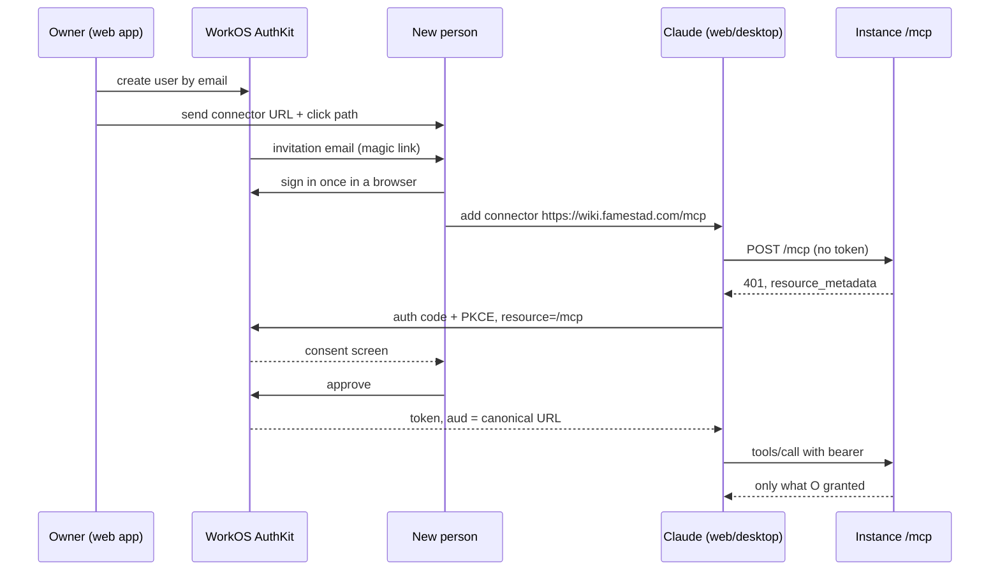
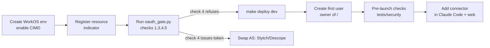

# mcp4me PRD

2026-09-17 · Josh Famestad

## Problem and goals

A team's shared knowledge cannot today be written to safely by AI agents with per-person, per-place rights. mcp4me v1 is a self-deployed remote MCP server holding one permissioned tree of markdown articles per organization, where every write is by an agent acting for a signed-in person and nothing is visible until an owner grants it.

**The problem, in the user's terms.** A team that shares one vision ships faster, but the vision is the team's, not one person's, and each part of it has an owner who should be the only writer of that part. Existing tools force a binary: everyone can edit the whole wiki, or the wiki is private. When agents join the team the gap widens: they need to read broadly and write into the store, and no hosted wiki gives a remote MCP client per-user OAuth with a tree-shaped permission model behind it.

**Goals for v1**

1. One tree per organization, on the organization's own AWS account and domain, reachable from Claude (claude.ai, Claude Code) as a remote MCP server.
2. Default deny. A new user sees nothing until an owner grants `read`, `write` or `own` on a folder or article. Absence and denial are indistinguishable.
3. Every version immutable and attributed to the signed-in person whose agent wrote it, in metadata an agent cannot rewrite.
4. Grant changes, user creation, audit-log reads and hard deletes are impossible from the tool surface, by IAM as well as by omission.
5. The storage credential on every request is scoped to the calling subject, so an application bug cannot leak beyond that user's grants.
6. Near-zero operating burden and under US$5/month at household scale; a day to set up a new instance.

**Non-goals for v1** (HANDOFF §1.2): no human editing surface; not git; not multi-tenant SaaS; no federated identity; no unattended agents; no bundle export; no users outside the organization.

**Scale.** Hundreds of articles today; nothing forecloses ten thousand. First tenant is a household of four with no turnover.

## Users and personas

There is one kind of principal, a user; roles are positions in the tree, not classes of account. The people below differ only in what they own.

| Who | What they do | What they need from v1 |
| --- | --- | --- |
| Instance operator | Deploys the stack, configures WorkOS, creates the first user as owner of `/` | `make deploy`, a gate script that fails the install if the resource indicator is wrong, a runbook |
| Root owner (admin) | Owns `/`; grants and revokes; reviews unowned and vacated-path grants; hard-deletes rarely | A web console for grants and people; an audit log; move-impact previews |
| Subtree owner | Owns one folder (a persona namespace such as `/builder/`); grants within it, including `own` | Delegation bounded by the tree; grants that outlive them surface for review |
| Writer | Holds `write` on a folder; works through an agent | Optimistic concurrency that fails without writing; clear 409/403/404 semantics |
| Reader | Holds `read` on a folder or single article | Search that finds granted articles by path filter; history of the path |
| Agent (Claude) | Acts for a signed-in user; inherits exactly that user's grants | Nine tools, bounded responses, no way to change grants |
| Household member | Non-technical; onboarded by invitation email | Magic-link sign-in, a one-screen connector setup on web or desktop, then phone use |

**The reference persona set.** The first tree is a product decision register with three namespaces, each owned by one accountability: Investor (IDRs, the bets), Seller (MDRs, market and user decisions), Builder (ADRs, architecture), plus a root-level `escalations/` queue every persona can write to. The architecture commits to the pattern, not the trio: an organization brings its own personas by creating namespaces and owners (MDR-0002).

**Who is not a user in v1.** Anyone outside the organization; any unattended process. Both are specified for v2.

## Scope

v1 is the server, the tool surface, the grant model and the admin web application. Everything that widens the audience or removes the human from the loop is v2.

| In v1 | Deferred to v2 (specified, not built) | Out |
| --- | --- | --- |
| Eleven MCP tools over streamable HTTP at `/mcp` | Users outside the organization, and invitation onboarding | A human editing surface |
| WorkOS AuthKit as authorization server; substrate as pure resource server | Cross-instance references (`/a/` grammar adopted now) | git as the store |
| Positional grants: `read`, `write`, `own`; folder cascade; additive union; no deny | Unattended agents, as an authenticated HTTP API beside `/mcp` | Multi-tenant SaaS |
| Immutable versions on S3; tombstone archive; pointer-first move | Bundle export (needs scoping and disclosure logging) | Federated identity or cross-instance token exchange |
| Admin web app: create people, grant, revoke, audit log, hard delete, confirm widening moves | Event streams (the 2026-07-28 revision made SSE optional) | Deny rules |
| Audit log of every read, write, grant and denial | Full-text search (v1 matches metadata; the contract does not change) | A `history` permission |
| Metadata search filtered by the caller's grants | Signed-in read-only web path for people who cannot add a connector | Seeding, templates, starter content |
| Dev and prod stacks; hand-deployed certificate stack; `make deploy` | Custom AuthKit login domain (US$99/month) |  |

**Fixed limits.** Paths ≤ 512 characters, lowercase, no `.`/`..` segments, no `_`-prefixed segments; `index.md` and `log.md` reserved. Article bodies ≤ 1 MiB. Tool results bounded to Claude Code's 25,000-token budget; `search` returns snippets and paths, never bodies; `read_article` takes a section or byte range.

## Functional requirements

Eleven tools, three permissions, two scopes. Every read is a search or a targeted fetch; an agent never walks the tree.

**Tool surface** (HANDOFF §10)

| Tool | Arguments | Scope | Needs |
| --- | --- | --- | --- |
| `search` | `query, prefix?, limit?` | `wiki.read` | `read` on each hit |
| `list_folder` | `path` | `wiki.read` | `read` on path (folder grants only) |
| `read_article` | `path, section?, byte_range?` | `wiki.read` | `read` |
| `resolve_reference` | `url` | none | none; parses a string |
| `list_versions` | `path, limit?, cursor?` | `wiki.read` | `read` on path |
| `read_version` | `path, version_id, byte_range?` | `wiki.read` | `read` on path |
| `create_article` | `path, content, frontmatter` | `wiki.write` | `write` on any ancestor |
| `update_article` | `path, content, if_version, frontmatter?` | `wiki.write` | `write` |
| `move_article` | `from, to, if_version` | `wiki.write` | `write` on both; refused `boundary_change` if anyone gains access |
| `archive_article` | `path, if_version` | `wiki.write` | `write` |
| `unarchive_article` | `path, if_version?` | `wiki.write` | `write` |

**Behaviour the tools must have**

- FR-1 Every mutating call carries `if_version` (the S3 ETag). A stale token fails with `409`, writes nothing, and returns the current version and body.
- FR-2 A read landing on a pointer returns one forward reference and stops. The server never follows a chain.
- FR-3 Archive writes a tombstone version; unarchive writes a restoring version. Both are entries in the path's one history. Create at an archived path is refused `409 archived` with the tombstone's version.
- FR-4 Move writes the pointer at the source first, then the content at the destination. History stays at the old path under the old grants; the destination starts a fresh chain.
- FR-5 `move_article` computes who gains and who loses access. Any gain is refused on the tool surface with the report; the web app performs it after a person confirms.
- FR-6 Listings and search return only what the caller may see. Unreadable paths are `404` on every read tool; writes to a path the caller lacks are `403`.
- FR-7 `frontmatter` replaces rather than merges. `type` is required; `pointer` and `archived` are server-only values and rejected on input. Unknown keys round-trip.
- FR-8 `index.md` and `log.md` are generated per request, filtered to the caller's grants, never stored.
- FR-9 Bodies carry `total_bytes` and `returned_bytes`; list-shaped results carry `truncated` and `cursor`.

**Admin web application** (not tools, by design)

- FR-10 Create a person: enter an email; the system creates them at WorkOS and records a profile and initial grants. No PROFILE row means not logged in.
- FR-11 Grant and revoke `read`/`write`/`own` on any node within a subtree the granter owns. Every grant records who made it. Grants outlive their granter and surface as unowned for review.
- FR-12 Show the permission consequence at the moment structure is chosen: a move preview names who gains and who loses, listing only people the mover administers; disabled subjects are excluded.
- FR-13 Read the audit log. Hard-delete, logged and rare, owner-only.
- FR-14 Wherever people edit or share, state that editing is not redaction: `read` covers the path's history.

**Onboarding**

- FR-15 Installation fails if the resource indicator registration fails or the token's `aud` is not exactly the canonical MCP URL.
- FR-16 Adding a person is five steps, three performed by them: invitation email, magic-link sign-in, add the connector on web or desktop, consent. The invitation email is the whole onboarding experience and must fit one screen.

## Non-functional and security requirements

The primary adversary is the internet-wide scanner, not a targeted attacker; every MUST below is a defect if broken, not a preference. A targeted attacker and a malicious insider are out of scope, and said so.

| ID | Requirement | Verified by |
| --- | --- | --- |
| NF-1 | The substrate is a pure OAuth 2.1 resource server. It implements no `/authorize`, `/token` or `/register`. | Route table test: those paths answer `404` |
| NF-2 | Every bearer token is validated on every request: signature against the AuthKit JWKS, `iss`, `aud` equal to the canonical MCP URL, expiry; algorithm pinned, never read from the token header. Authorizer cache is zero. | Wrong-audience, `alg: none` and expired tokens are rejected |
| NF-3 | Unauthenticated `POST /mcp` returns `401` with `WWW-Authenticate: Bearer resource_metadata=…`. A valid token lacking scope returns HTTP `403 insufficient_scope`. A grant denial is a tool error, never `insufficient_scope`. | Route table test; error-semantics tests |
| NF-4 | Protected resource metadata at `/.well-known/oauth-protected-resource` and the `/mcp`-suffixed variant, publicly fetchable; `authorization_servers` holds the AuthKit domain as its only entry. | `GET` returns `200` with no auth |
| NF-5 | The storage credential on every read and write is an STS session policy scoped to *(subject, prefix, permission)*; no service role on the read path; a zero-grant user causes no `AssumeRole` call at all. | Pre-launch check 5; prefix-escape tests |
| NF-6 | The MCP function's IAM role is read-only on the grant table; only the web app role can write grants; the storage role cannot delete a version. | IAM policy tests |
| NF-7 | Received bearer tokens are never forwarded downstream. | Code review; no outbound call carries `Authorization` |
| NF-8 | Audit log records per request: subject, token id, audience, path, decision, grants used. Denied reads are logged. Tokens, cookies, bodies and frontmatter values never reach a log. | Log schema test |
| NF-9 | Access token lifetime ≤ 15 min; refresh rotated; credential cache ≤ 15 min. Both values are config and move together. | Measured revocation latency (open item O-4) |
| NF-10 | `Origin` header, when present and invalid, is rejected `403`. `GET`/`DELETE /mcp` return `405`. Header/body disagreement returns `400 -32020`. | Conformance tests |
| NF-11 | S3 and DynamoDB answer only to this account's roles: account-level public-access block, bucket and table resource policies denying all other principals, no IAM user naming either. | Pre-launch check 4 |
| NF-12 | Backups encrypted with a customer-managed key; an alarm on any snapshot shared outside the account; a restore rehearsed once before launch. | Pre-launch check 7 |
| NF-13 | Gateway throttle 20 req/s steady, 50 burst, and a daily billing alarm from day one; per-subject limits 60 calls/min and 200 writes/hour with `429 Retry-After`. | Load test; alarm fires |
| NF-14 | Production errors reveal nothing: generic `4xx`/`5xx` bodies, one path prefix at the edge, everything else `404`. | Pre-launch check 8 |
| NF-15 | Every tool response fits Claude Code's 25,000-token result budget and returns within 240 s. | Response-size tests |
| NF-16 | Push protection and secret scanning on; dependencies pinned with auto-merged patch updates; scheduled rebuild-and-deploy; branch protection with review. | Repository settings |
| NF-17 | Endpoint resolves only to globally routable IPv4 and is reachable from Anthropic's egress range. Split-horizon DNS, CGNAT and IPv6-only hosts are unsupported. | Deployment prerequisite (O-5: verify the published range) |

**Two accepted risks, stated to users.** Revocation is prospective: it stops future reads and cannot recall text already in someone's context. Public exposure is a requirement: a hosted AI client cannot connect to anything else, so the operator posture above is the price of the product, not optional hardening.

## User journeys

Four journeys cover v1: a person joins, an agent writes, an agent moves something across a boundary, and an operator stands up an instance.

**J1 — A household member joins.** Five steps, three theirs.

The invitation email and the consent screen are the whole experience. Setup cannot begin on a phone; use can continue there.

**J2 — An agent records a decision.** The user asks Claude to draft an ADR. Claude calls `search` to find the governing bet, `read_article` on it, then `create_article` at `/builder/decision-records/adr-0016.md` with `status: proposed`. The version is stamped with the user's subject in object metadata. A second agent editing the same file later sends `if_version`; if the ETag moved, it gets `409` with the current body and merges. A human accepts the record in a later session; the agent never sets `accepted`.

**J3 — An agent moves an article across a boundary.** The user asks to move `/builder/costs/q4-estimate.md` into `/investor/inputs/`. `move_article` computes the impact: the Investor owner gains read. The tool refuses with `403 boundary_change` and the report. The user opens the web app, sees who gains and who loses, confirms. The pointer is written at the old path first; anyone who could read `/builder/costs/` now sees a forward reference, not the content. The Investor sees the present and none of the past.

**J4 — An operator stands up an instance.**

The install fails closed at B and C: a wrong or silently defaulted audience is a failed install, not a warning.

## Success metrics and kill criteria

The v1 substrate has no governing bet of its own; the nearest is IDR-0005 (Phase 1 hosted MCP, review 25 Sep 2026), whose criteria transfer with the authorization server swapped. The metrics below are drawn from the accepted bets and MDR-0002 and are proposed for the superseding bet, not yet accepted.

**Bets on the register**

| Bet | Appetite | Review | Verdict |
| --- | --- | --- | --- |
| IDR-0001 Tranche 1, walking skeleton | 4 build-days, <$10/mo | 14 Sep 2026 | `met`, reviewed early on 4 Sep; all five criteria |
| IDR-0002 Tranche 2, wiki becomes the register | 2 build-days, <$15/mo | 11 Sep 2026 | No review recorded |
| IDR-0003 Tranche 3, hardened pilot | gated on IDR-0002 review | none | `proposed` |
| IDR-0004 Defer semantic search | none | none | `accepted` |
| IDR-0005 Phase 1 hosted MCP | 2.5 build-days, <$5/mo | 25 Sep 2026 | Open; design superseded by the 13 Sep handoff |

**Launch criteria for v1** (pass/fail, all verifiable by running something)

1. The four WorkOS gate checks pass: metadata advertises CIMD and `none`; the resource indicator is registered; a PKCE round trip yields `aud` equal to the canonical URL; an unregistered resource is refused.
2. All eleven tools answer correctly from Claude Code and claude.ai on a machine holding no AWS credentials.
3. A write through the hosted path is attributed to the verified subject, and a client lying about identity in the request body is provably ignored.
4. The pre-launch checklist (HANDOFF §12.8) passes end to end: route table, token rejections, storage answers to nothing but the storage role, zero-grant user mints nothing, no credentials in the repository, backup restore rehearsed, production errors reveal nothing.
5. Measured revocation latency, token plus credential cache, ≤ 15 minutes end to end.
6. A household member completes onboarding from the invitation email without help.
7. Run cost over the first month projects under US$5.

**Product signals to measure at the first review** (MDR-0002 candidates)

- Time to answer "why did we choose X" and "what work does this bet fund", trending down.
- Share of active work items traceable to a live bet, trending toward 100%.
- Onboarding time for a new person or agent to become productive.
- Whether an IDR evaluation reads a Builder-owned cost estimate in place rather than out of band.

**Kill criteria**

- Gate check 4 issues a token for an unregistered resource, and Stytch or Descope fails the same check.
- The verified subject cannot reach the storage layer non-forgeably without a second identity system.
- Recording a decision through the wiki is measurably slower or more error-prone than the legacy register (IDR-0002 criterion 1).
- Effort passes twice the appetite with criteria unmet: automatic review, no silent extension.
- Steady-state cost above US$15/month on a design with no always-on component: escalate, because the design is wrong, not the forecast.

## Risks and open questions

The two risks that can change the shape of v1 are the WorkOS gate and the client's own limits on who can connect; everything else is tracked with a decide-by.

| Risk | Consequence | Mitigation | Decide by |
| --- | --- | --- | --- |
| WorkOS silently defaults the audience (gate check 4) | Every instance on the account shares one audience; isolation gone | Fail-closed install; Stytch or Descope substitute; nothing downstream changes | **Decided 23 Sep 2026** — check 4 passed: the unregistered resource was refused at `/token`, `HTTP 400 invalid_target`. Risk did not materialize |
| CIMD not enabled in WorkOS staging | Gate cannot run; nothing deploys | Enabled; gate run 23 Sep 2026 against staging — checks 1, 3, 4, 5 and the AS-9 lifetime check passed. Check 6 (CIMD origin allowlist) does not exist in the WorkOS dashboard; check 7 self-signup is now disabled | **Done** |
| No AWS development account on the build machine | Nothing deploys | Provision account 588747760390 credentials | Now |
| Client constraints bound sharing | Free accounts hold one connector; managed-org members cannot self-serve; setup is web/desktop only | Design the invitation around "personal account, web or desktop, one instance"; defer everyone else | Before the invitation email |
| Connector auth settings fixed once added | Swapping the authorization server means every user reconnects | Get the gate right before launch; at four people a swap is an afternoon | Launch |
| Register and code have diverged | IDR-0005, ADR-0009 and ADR-0015 fund Cognito + AgentCore; the build is WorkOS + Lambda | Draft a superseding ADR and a Phase 1 bet; record IDR-0002's review | Before IDR-0005 review, 25 Sep |
| Revocation latency unmeasured (O-4) | Token and credential cache may not be coherent | Measure end to end; both values are config and move together | Before increment E |
| AuthKit consent screen behaviour (O-3) | The anti-phishing surface is WorkOS's; unverified what it shows for CIMD clients | Inspect: client host vs self-asserted name; loopback warnings | Before increment E |
| Anthropic egress range stale (O-5) | AS-11 becomes a false prerequisite | Verify the published range before treating it as normative | Increment G |
| Pointers are permanent | A vacated path can never host a new article | Confirm acceptable, or design an expiry story | Increment B |
| Product-phase authorization server (O-1) | Per-tenant deployment vs hosted SaaS identity are in tension | Each tenant provisions WorkOS; or hosted multi-tenant; or shim-as-AS over Cognito/Logto | Post-v1 |

**Open questions for the owner**

- Is the substrate the product, or is the decision register the product and the substrate its engine? MDR-0002 says the latter; the handoff says the former. The PRFAQ is written as the former with the register as the first use.
- Does the v1 build get its own IDR, or does IDR-0005 get superseded in place with the auth swap?
- Who reviews IDR-0002, and is the legacy triad-dr register read-only today? Its `reconcile.py` clean-exit criterion is unverified here.
- Which of the five open escalations (ESC-0001 to ESC-0005) does v1 close? ESC-0003 (agents inherit the human's full rights) is answered by design: the agent's credential is the user's, and narrower delegation is not expressed. Say so or keep it open.
